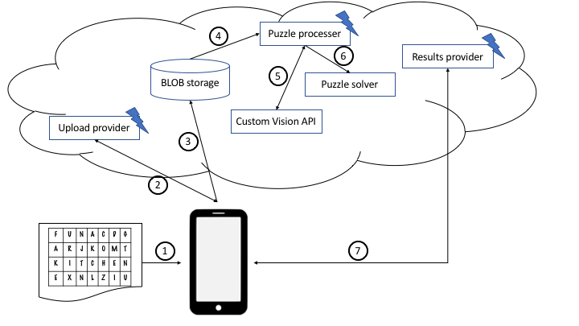

# Word Puzzle

I am a programmer. If you are reading this, chances are that you are also into coding and I bet you will agree: if we see a problem, we begin to wonder if we should solve it manually or maybe write some code to solve the problem and all other related problems.

**Fun facts**

* We often don't care that solving the problem in a generic way takes way more time compared to the manual approach. 
* We love to totally overengineer things!

As part of his homework my son had to solve a word puzzle. A word puzzle is a grid of what appears to be random characters and he had to find the words hidden in there. Try to find the words "FUN", "FAKE" and "KITCHEN" in the grid below!

````
-----------------------------
| F | U | N | A | C | D | G |
-----------------------------
| A | R | J | K | O | M | T |
-----------------------------
| K | I | T | C | H | E | N |
-----------------------------
| E | X | N | L | Z | I | U |
-----------------------------
````

For the specific puzzle he was looking at he had found all words but one and he asked me to help. Instead of searching for the word, an idea started to form in my mind: wouldn't it be great to take a picture of the puzzle and let the computer find it? How hard can it be with the power of C#, Artifical Intelligence and Azure Cloud Computing! That's how this workshop was born.

## Target audience

* Azure developers

This tutorial assumes that you're familiar with software development in C# and have some experience with Azure. For more details about a specific topic we sometimes refer to material available on [Microsoft Learn](https://docs.microsoft.com/en-us/learn/).

## Abstract

### Workshop
In this workshop, we will go through all the steps necessary to successfully create a FaaS (Function as a Service) based solution that allows uploading a picture of a word puzzle to the Azure cloud, setup an AI (Artificial Intelligence) to recognize the puzzle's characters and code an algorithm to find given words in the processed puzzle. Once everything is setup and deployed using Azure DevOps, we wil implement a Xamarin.Forms based client project to allow for direct upload of scanned puzzles.

After the workshop you will be able to create complex solutions by connecting different Azure based services. Each service by itself is simple and self contained.

### Application design overview



1. Client acquires image
1. Client contacts Azure function to get upload information and receives upload URL as well as URL to retrieve results at
1. Client uploads puzzle image and meta data directly to Azure BLOB storage
1. BLOB storage triggers Azure function to kick off puzzle processing
1. Azure function contacts Azure Custom Vision API to extract text from uploaded image
1. Azure function runs code to find words in extracted text
1. Client polls URL to get results back

### Content

1. [Setup Azure Storage Emulator](./content/Setup_Azure_Storage_Emulator.md)
1. [Create a solution in Visual Studio](./content/CreateBlankVSSolution.md)
    1. [Add and implement Puzzle solver](./content/CreatePuzzleSolverProject.md)
    1. [Split puzzle image](./content/SplitPuzzleImage.md)
    1. Add and implement Azure Functions project
        1. [Receive a BLOB SAS](./content/Add_and_implement_Azure_Functions_project_1.md)
        1. Process an uploaded puzzle image
            1. [Setup custom vision AI](./content/Setup_Custom_Vision.md)
            1. [Send image to custom vision AI](./content/SendImageToCustomVisionAI.md)
            1. [Create a BLOB triggered function](./content/Add_and_implement_Azure_Functions_project_2.md)
        1. [Return processed puzzle to client](./content/ReturnProcessedPuzzle.md)
    1. [Upload to BLOB storage](./content/Upload_to_BLOB_storage)
1. [Build a client app](./content/BuildClientApp.md)
1. Configure services in Azure Portal
    1. BLOB storage
    1. Functions
1. Deploy solution to Azure
    1. Setup DevOps and Github integration
    2. Solve a word puzzle on Azure