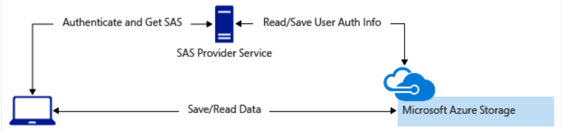
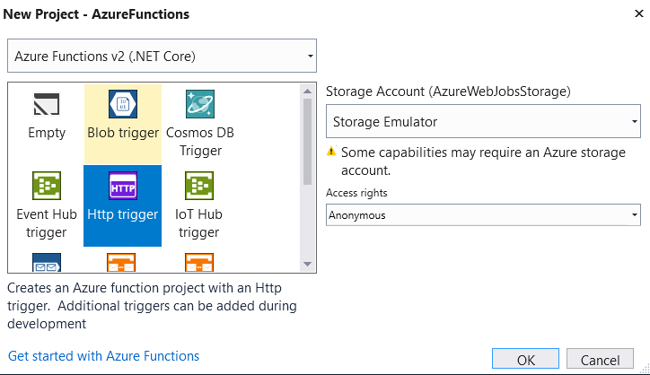

# Add and implement Azure Functions project

Azure Functions allows developers to host business logic that can be executed without managing or provisioning infrastructure. A function always has a trigger that will start it. To learn everything about Functions-as-a-Service (FaaS), please check out the [content at Microsoft Learn](https://docs.microsoft.com/en-us/learn/browse/?products=azure-functions)

In this part of the tutorial we are going to create three functions, each handling a specific portion of our app's backend:

* Upload provider: this is triggered by an HTTP POST and will return the upload location for the puzzle image.
* Puzzle processer: triggered by the Azure BLOB storage after the image has been uploaded. It will figure out the contents of the puzzle image.
* Results provider: an HTTP GET triggered function the client can use to download the processed puzzle.

## Upload provider
The image containing the word puzzle must be uploaded to the server infrastructure for processing. There are certainly different ways to achieve this: we could write a fully fledged ASP.NET Core backend to receive the image. Or we could upload the image directly to the Azure function. Both approaches don't scale very well - not that it would be necessary to scale a word puzzle processor but maybe this is a service the world has been waiting for, so we better prepare to scale out, right? :-)

We are going to use a combination of the Azure BLOB storage and Azure Functions. BLOB storage allows clients to upload directly to it, all the client needs as a way of accessing the storage. Typically, this access is granted only temporarily via a SAS (Shared Access Secret). To learn about SAS and securing a storage account, please have a look at [this module on Microsoftt Learn](https://docs.microsoft.com/en-us/learn/modules/secure-azure-storage-account/). BLOB storage scales extremely well, so we can handle a lot of simulataneous uploads. To get the SAS we are going to use an Azure Function; it's the perfect workload for a function: short running, limited scope and stateless.



### Create the function
Open the previously created Visual Studio solution with the PuzzleSolver library in it. You may want to create another solution folder named _Functions_ but it's not strictly necessary.

Add a new **Azure Functions** project called "AzureFunctions". Make sure to select "Azure Functions v2 (.NET Core)" from the dropdown and use the "Http Trigger". The storage account should be set to "Storage Emulator" and the access rights to "Anonymous".



By default the function is named "Function1". Rename the file and the function to "UploadProvider" and change the allowed HTTP verbs to have only "post". It should look like this:

```cs
public static class UploadProvider
{
    [FunctionName("UploadProvider")]
    public static async Task<IActionResult> Run(
        [HttpTrigger(AuthorizationLevel.Anonymous, "post", Route = null)] HttpRequest req, ILogger log)
    {
        log.LogInformation("Upload requested");
        return new BadRequestObjectResult("Not implemented yet!");
    }
}
```

#### Get access to storage account

Since we need to access the blob storage we have to connect the function to it.
This can be achieved conveniently by using the `StorageAccountAttribute` that allows us to inject the storage reference into the function:

```cs
[StorageAccount("StorageConnectionString")] Strg.CloudStorageAccount storage
```

To use it, two NUget packages must be added to the functions project:

* Microsoft.Azure.WebJobs.Extensions.Storage
* Microsoft.Azure.Storage.Blob

**Note:** As of the time of this writing, there's big mess going on regarding namespaces in the "Microsoft.Azure.Storage.Blob" package. For details check out https://github.com/Azure/azure-storage-net/blob/master/Common/changelog.txt and https://github.com/Azure/azure-storage-net/issues/842#issuecomment-456647681. As a result, make sure to install version **9.4.0-preview** of the package and not the latest (9.4.2).

By adding the above to the signature of the function, the `storage` parameter will give us access to the storage account configured under the connection string `StorageConnectionString` in the **local.settings.json** file:

```json
{
  "IsEncrypted": false,
  "Values": {
    "FUNCTIONS_WORKER_RUNTIME": "dotnet",
    "StorageConnectionString": "UseDevelopmentStorage=true"
  }
}
```

We can now add the code to get a reference to the container in our local storage which we created earlier. For a full reference, please see the [source code in this repository](/src/AzureFunctions/UploadProvider.cs).

```cs
using Strg = Microsoft.WindowsAzure.Storage;
[...]
var blobClient = storage.CreateCloudBlobClient();
Strg.Blob.CloudBlobContainer container = blobClient.GetContainerReference("wordpuzzleupload");
```

Details about creating a SAS can also be found in the [Microsoft documentation](https://docs.microsoft.com/en-us/azure/storage/blobs/storage-dotnet-shared-access-signature-part-2).

The function now returns a URL we can use to upload the word puzzle image directly to the BLOB storage.
If you want to test it, use a tool like PostMan and run a POST request against the URL shown in the Azure Functions output window. In my case, that's `http://localhost:7071/api/UploadProvider`. The returned Json content will look like this:

```json
{
    "uploadurl": "http://127.0.0.1:10000/devstoreaccount1/wordpuzzleuploads/0e419e46-53fe-41b9-b37d-b5d1cc85cae6?sv=2018-03-28&sr=b&sig=O%2BqJ47mex%2FxhOM4ifn1W2M%2FWsfH19SUmfV96apQ76uw%3D&se=2019-02-27T08%3A33%3A38Z&sp=cw",
    "id": "0e419e46-53fe-41b9-b37d-b5d1cc85cae6"
}
```

The URL can be used to upload directly to the BLOB storage. The identifier can be used by the client to check if a puzzle has been processed and is ready for pickup.
The upload URL is valid for a limited time only, preventing "spam" uploads in case somebody tries to share it. We will get back to to the upload procedure later.