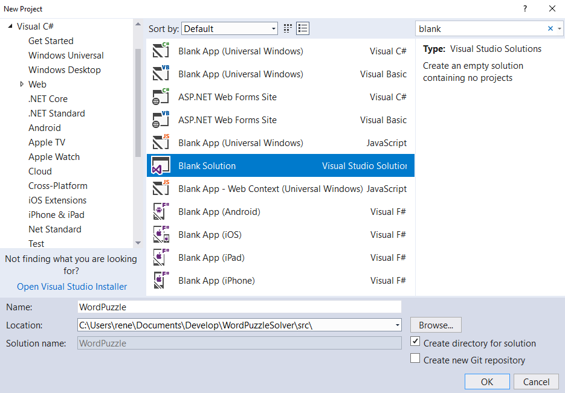

# Create a Visual Studio Solution

This part assumes that your environment is setup for Azure development. If that's not the case, please have a look at [Prepare your development environment for Azure development](https://docs.microsoft.com/en-us/learn/modules/prepare-your-dev-environment-for-azure-development/) on Microsoft Learn. 

## Start with an empty solution

The initial solution will be empty. Over time, we will add separate projects to it.
I decided to put the solution into a subfolder called _src_.

