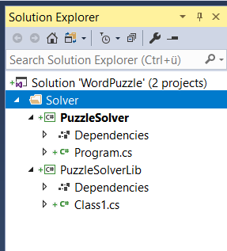

# Create Puzzle Solver Project

Although this is all about Azure and the cloud, we're going to start with a simple .NET Core console app that references a .NET standard library which contains the code to scan a two dimensional array of text character to find a set of predefined words. We can then use this library from within the yet to be created Azure functions.

## Create the project

* In the previously created solution, add a new .NET Core Console project and call it _PuzzleSolverTest_.
* Add another project, this time a .NET standard library called _PuzzleSolverLib_

Feel free to organize the two projects in a solution folder if you like to.



## Search algorithmn

Our plan is to get back a two dimensional array of text characters from the vision API and we also know what words to look for. Given this input data we can implement an algorithm to search for words.

Let's use the following puzzle as an example. We are looking for the words "FUN", "FAKE" and "KITCHEN":

````
---------------------------------
|   # 0 # 1 # 2 # 3 # 4 # 5 # 6 #
=================================
| 0 # F | U | N | A | C | D | G |
---------------------------------
| 1 # A | R | J | K | O | M | T |
---------------------------------
| 2 # K | I | T | C | H | E | N |
---------------------------------
| 3 # E | X | N | L | Z | I | U |
---------------------------------
````

Columns span from 0 to 6 and rows from 0 to 3.

We can create a "brute force" algorithm by considering every combination of column and row (a cell) as a starting point for a word. The algorithm will iterate over all the cells and call a helper function to check if the cell is the starting point of a word. 
By having a separate function to search for words, we can easily search vertically, horizontally but also diagonally.

If a word is found, it will be stored in a result set that also contains the cell positions of the word's individual characters.

## Give it a try

Think about a possible implementation. Maybe you can come up with your own solution. All code should go into the library project. The console app is there to test the functionality and outpout the results.

There should be a method

`public static SearchResult SearchForWord(char[,] grid, string word)`

to search for a spefic word in a grid of characters.

`SearchResult` is a structure:

```cs
public class SearchResult
{
    public bool Found { get; set; }
    public GridPosition StartPos { get; set; }
    public string Word { get; set; }
    public ArrayList Letters { get; set; } = new ArrayList();

    public void AddLetterMatch(char letter, int row, int col)
    {
        Letters.Add(new LetterAtPosition(letter, row, col));
    }
}
```

The two other types used are `GridPosition` and `LetterAtPosition`. You can find them here:

```cs
public struct GridPosition
{
    public int Row;
    public int Col;

    public GridPosition(int row, int col)
    {
        Row = row;
        Col = col;
    }
}

public struct LetterAtPosition
{
    public GridPosition Position { get; set; }
    public char Letter { get; set; }
    public LetterAtPosition(char letter, int row, int col)
    {
        Letter = letter;
        Position = new GridPosition(row, col);
    }
}
```

A completed version of the solver can be found in the repo.


