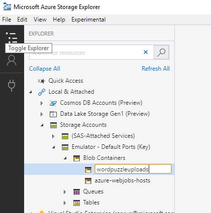

# Azure Storage Emulator

The Azure Storage Emulator will allow us to store assets like BLOBs locally wihtout being connected to the cloud. This is very useful for testing. 

We will not go into the details of the setup process. Instead please refer to the [documentation](https://docs.microsoft.com/en-us/azure/storage/common/storage-use-emulator) and return to this document when done.

## Azure Storage Explorer

A quick way of inspecting the content of the local storage is to use [Azure Storage Explorer](https://docs.microsoft.com/en-us/azure/vs-azure-tools-storage-manage-with-storage-explorer). This is an application available for Windows, macOS and Windows. It can be used to browser not only the local storage but also cloud based storage accounts. We will use the Azure Storage Explorer to create the initial BLOB container structure and to test if the Azure Function we're going to build will be triggered correctly.

Please follow the instructions in the link above to download and install Azure Storage Explorer.

### Create the BLOB container

We will upload our word puzzle images to a BLOB storage. BLOBs are stored inside containers - think of them as directories. To begin, add a container called _wordpuzzleupload_ to the BLOB storage.

