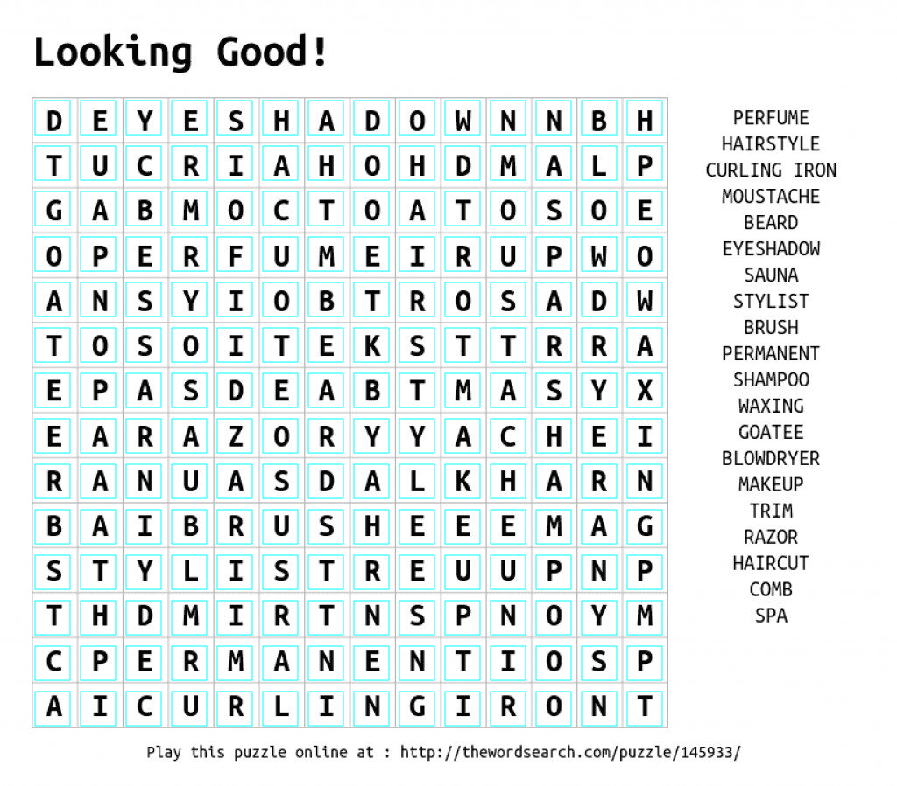

# Split puzzle image

When we introduced the word puzzle solver algorithm, we learned that it operates on a two dimensional array of individual ASCII characters. Our input format is however supposed to be a picture of the puzzle. To get the characters we will have to analyze the picture and extract the required content. This is a two step process. The first step is to split the image into indvidual cells containing the character images. The second step is then to recognize the image characters and turn them into ASCII text.

## Requirements

Every word puzzle consists of a number of rows and columns defining the cells. Every cell contains one character. 



Looking at the image above we find that various paramaters are required to correctly capture the cell content:

* Number of columns
* Numnber of rows
* Top offset: vertical distance in pixels from the top of the image to the top edge of the first row
* Left offset: horizontal distance in pixels from the left edge of the image to to left edge of the first column
* Width of the cells
* Height of the cells
* Vertical spacing between two rows
* Hortizontal spacing between to columns

Setting all of these paramaters correctly allows us to capture the content of each cell (highlighted with cyan colored rectangles). 

> **Note:** The cyan colored rectangles in the image are created by the `ImageProcessing.SplitImage()` method we are about to discuss. You can find the completed implementation in the repo in the "PuzzleSolverLib" project.

The output of our splitting method should be an array of sub-images, each containing a single cell's content.

## Implementation

To process images in a cross platform compatible fashion we're going to use [SixLabors ImageSharp library](https://sixlabors.com/projects/imagesharp/) that is available as a Nuget package which we will add to the "PuzzleSolverLib" project in our solution.

We can then add a method called `SplitImage()` into a new static class called `ImageProcessing`:

```cs
public static IList<Stream> SplitImage(
    Stream imageStream,
    int columns,
    int rows,
    int offsetLeft,
    int offsetTop,
    int horizontalSpacing,
    int verticalSpacing,
    int cellWidth,
    int cellHeight)
```

It's accepting a stram as the input image (the picture provided by the client) and the parameters we discussed earlier. It returns a list of `Stream` where the first element is the sub-image at column 0 / row 0, followed by column 1 / row 0 and so on. The last entry in the list will be the input image overlaid by the found cells - this really is meant for debugging purposes mostly because it can take a bit to get the input parameters right.

Feel free to go and try to implement your version of the method. Using ImageSharp is easy! Here's an example of how to clone a portion of an input image and save it as a PNG:

```cs
var croppedImg = img.Clone(input => input.Crop(new Rectangle(x, y, cellWidth, cellHeight)));
var croppedStream = new MemoryStream();
croppedImg.SaveAsPng(croppedStream);
```

For details, please see the completed version in the repo which also contains a .NET Core console app that allows testing the logic.


